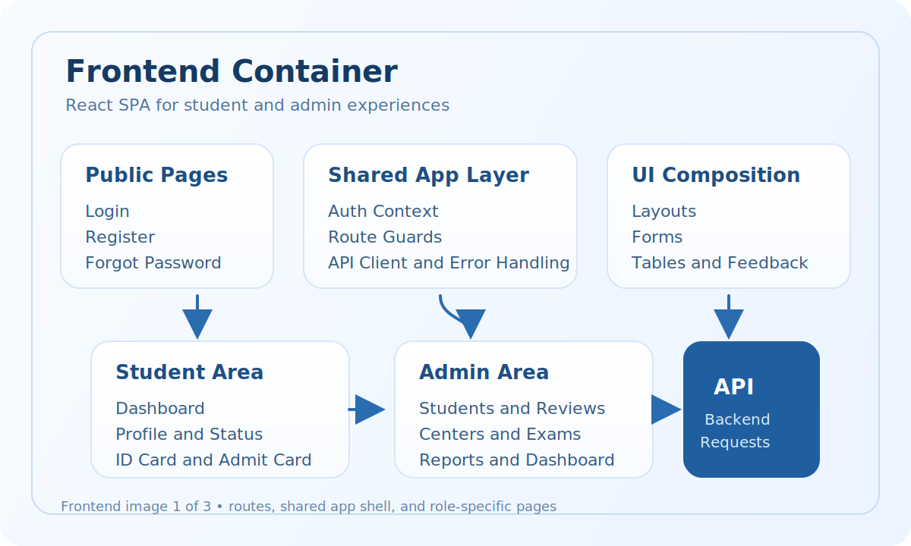
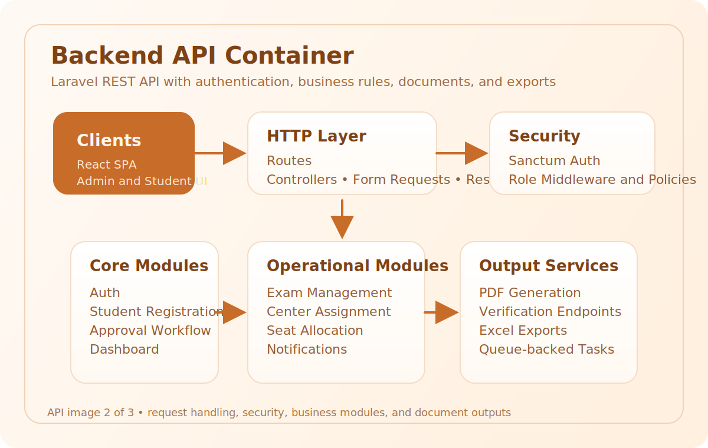
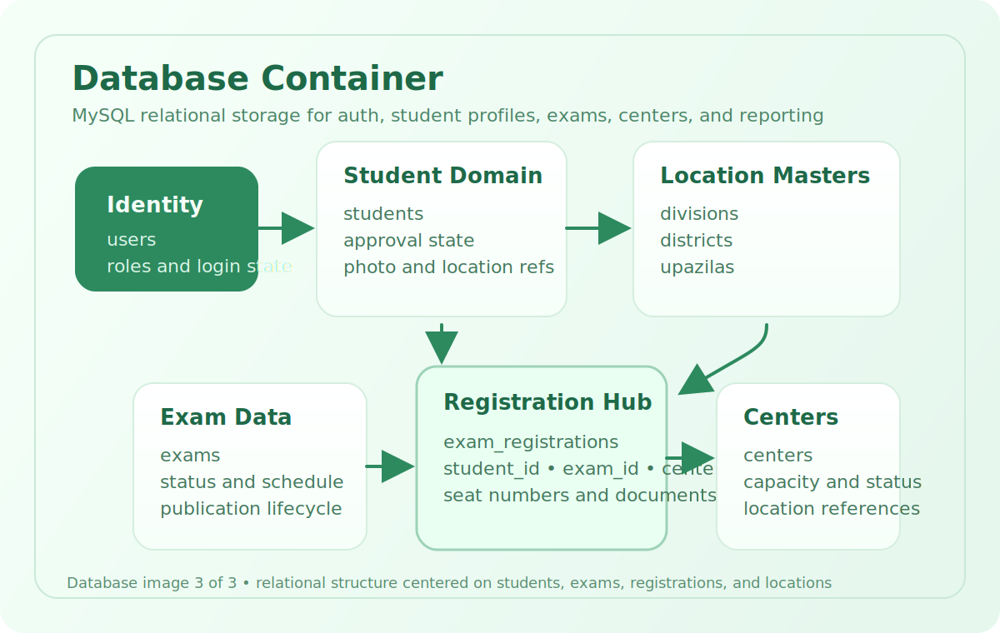

# System Architecture

## Recommended Architecture Style

Use a modular monolith for V1.

Reason:

- Faster to deliver than microservices
- Easier for small and medium teams to maintain
- Clear enough to evolve into services later
- Suitable for Docker-based local development

## High-Level Components

1. React frontend
2. Laravel API backend
3. MySQL database
4. File storage for uploaded photos and generated PDFs
5. Queue worker for document generation and notifications

## Runtime Topology

The runtime application stack for V1 should be limited to 3 deployable images or services:

1. `frontend`: React application container
2. `backend`: Laravel API container
3. `mysql`: MySQL database container

Notes:

- Jenkins is external to the application runtime and is responsible for CI/CD automation
- File storage is handled inside backend-attached storage paths for V1, not as a separate service
- Queue processing for V1 may run inside the backend container or as a backend-managed process, not as a fourth mandatory image

## Architecture Images

### Frontend Image



### API Image



### Database Image



## Logical Architecture

### Frontend

- Student-facing pages
- Admin-facing pages
- Shared authentication layer
- Shared API client
- Route guards by role

### Backend

- Auth module
- Student registration module
- Approval module
- Exam module
- Center module
- Document generation module
- Export module
- Dashboard module
- Notification module

### Data Layer

- MySQL relational schema
- Eloquent models
- Transaction-based write operations for approval, assignment, and seat allocation

## Request Flow

1. User interacts with React frontend
2. Frontend sends request to Laravel API
3. Laravel validates request and applies authorization
4. Business service executes database changes
5. API returns standard JSON response
6. Frontend updates UI state

## Container Communication Flow

1. User accesses the frontend container
2. Frontend sends API requests to the backend container
3. Backend reads and writes data in the MySQL container
4. Backend generates PDFs and serves document endpoints

## CI/CD Architecture

Jenkins manages the full CI/CD lifecycle for the 3-image application stack.

### Jenkins Responsibilities

- Pull code from GitHub
- Run backend validation and tests
- Run frontend validation and build checks
- Build Docker images for frontend and backend
- Reference the MySQL image version used in environment definitions
- Push application images to the container registry
- Deploy updated containers to the target server or environment
- Run post-deployment verification

### CI/CD Phases

1. Source checkout
2. Dependency installation
3. Backend code quality and automated tests
4. Frontend lint and build validation
5. Docker image build for frontend and backend
6. Registry push for application images
7. Deployment to target environment
8. Database migration execution
9. Smoke test and health verification
10. Release confirmation or rollback

## Recommended Laravel Structure

Use feature-oriented folders inside the standard Laravel app layout.

Suggested structure:

```text
app/
├── Actions/
├── DTOs/
├── Enums/
├── Helpers/
├── Http/
│   ├── Controllers/
│   │   ├── Admin/
│   │   ├── Auth/
│   │   └── Student/
│   ├── Middleware/
│   ├── Requests/
│   │   ├── Admin/
│   │   ├── Auth/
│   │   └── Student/
│   └── Resources/
├── Models/
├── Policies/
├── Services/
├── Support/
└── Traits/
```

## Recommended React Structure

```text
src/
├── app/
├── assets/
├── components/
│   ├── common/
│   ├── forms/
│   ├── layout/
│   └── tables/
├── features/
│   ├── admin/
│   ├── auth/
│   ├── centers/
│   ├── dashboard/
│   ├── exams/
│   ├── profile/
│   └── students/
├── pages/
├── routes/
├── services/
├── store/
├── styles/
└── utils/
```

## Key Technical Decisions

### Authentication

Use Laravel Sanctum.

Reason:

- Good fit for React SPA authentication
- Simpler than a full OAuth setup
- Works for browser session or API token patterns

### Authorization

Use role-based access control with policies.

Recommended roles:

- `super_admin`
- `admin`
- `student`

### Documents

Use DomPDF for PDF generation.

Generated documents:

- Student ID card
- Admit card
- Attendance sheet

### QR Verification

Each generated card should include a verification URL and QR code.

Recommended verification path:

- `/verify/student/{student_code}`
- `/verify/admit/{assignment_code}`

### Exports

Use Laravel Excel for:

- Student list
- Center list
- Attendance sheet
- Exam assignment report

## Service Boundaries

### Auth Service

- Register
- Login
- Logout
- Current user info

### Student Service

- Profile create and update
- Photo storage
- Student code generation
- Approval state transitions

### Exam Service

- Exam creation
- Student assignment
- Center assignment
- Seat number allocation

### Document Service

- ID card PDF generation
- Admit card PDF generation
- Verification payload generation

### Report Service

- Dashboard statistics
- Export builders

## Scalability Notes

- Use queues for heavy PDF generation and notifications
- Store files in a structured disk path by module and year
- Keep status transitions explicit and audited
- Add indexes on approval status, exam date, center, and student code

## Suggested Future Architecture Upgrades

- Add Redis for queue and caching
- Add S3-compatible storage for documents
- Add separate reporting database if report load becomes heavy
- Introduce event-driven notifications for email and SMS
