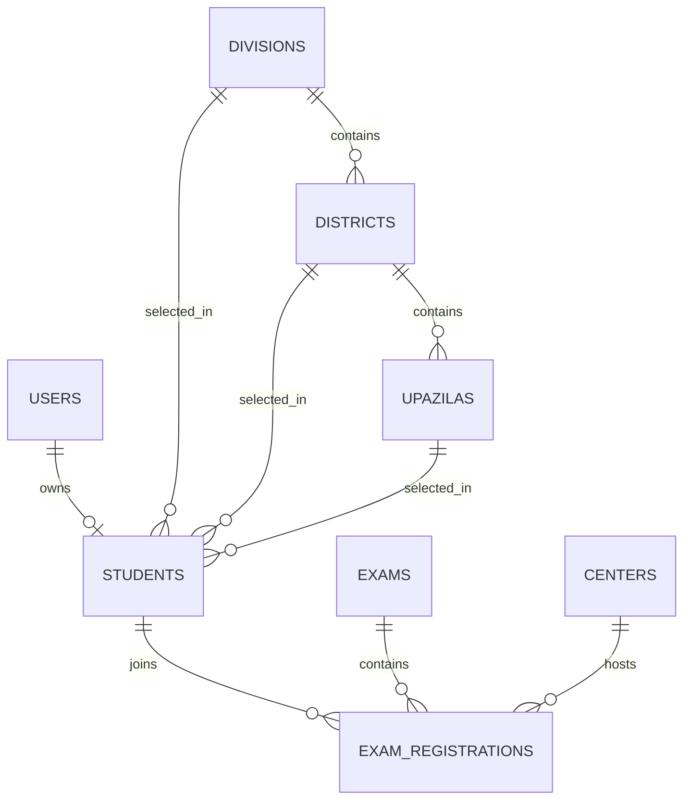

# Database Design

## Database Engine

MySQL 8+

## Design Principles

- Use numeric primary keys internally
- Use generated public codes for student and assignment references
- Normalize location data
- Preserve auditability for status changes
- Keep join tables explicit

## Core Tables

### users

Purpose: authentication identity for all roles.

| Column | Type | Notes |
| --- | --- | --- |
| id | bigint | primary key |
| name | varchar | login display name |
| email | varchar | unique |
| password | varchar | hashed |
| role | enum | super_admin, admin, student |
| email_verified_at | timestamp nullable | optional |
| remember_token | varchar nullable | framework support |
| created_at | timestamp | |
| updated_at | timestamp | |

### students

Purpose: extended profile for student participants.

| Column | Type | Notes |
| --- | --- | --- |
| id | bigint | primary key |
| user_id | bigint | unique foreign key to users |
| student_code | varchar | unique, generated after approval |
| full_name | varchar | |
| photo_path | varchar nullable | stored file path |
| father_name | varchar | |
| mother_name | varchar | |
| school_name | varchar | |
| class_name | varchar | |
| phone | varchar | indexed |
| address | text | |
| division_id | bigint | foreign key |
| district_id | bigint | foreign key |
| upazila_id | bigint | foreign key |
| status | enum | pending, approved, rejected |
| approved_at | timestamp nullable | |
| rejected_at | timestamp nullable | |
| approved_by | bigint nullable | admin user id |
| rejected_by | bigint nullable | admin user id |
| rejection_reason | text nullable | |
| created_at | timestamp | |
| updated_at | timestamp | |

### divisions

Purpose: top-level location master.

| Column | Type | Notes |
| --- | --- | --- |
| id | bigint | primary key |
| name | varchar | unique |
| code | varchar nullable | short code |

### districts

Purpose: second-level location master.

| Column | Type | Notes |
| --- | --- | --- |
| id | bigint | primary key |
| division_id | bigint | foreign key |
| name | varchar | indexed |

### upazilas

Purpose: third-level location master.

| Column | Type | Notes |
| --- | --- | --- |
| id | bigint | primary key |
| district_id | bigint | foreign key |
| name | varchar | indexed |

### centers

Purpose: exam center definitions.

| Column | Type | Notes |
| --- | --- | --- |
| id | bigint | primary key |
| name | varchar | |
| code | varchar | unique |
| location | text | |
| division_id | bigint nullable | foreign key |
| district_id | bigint nullable | foreign key |
| upazila_id | bigint nullable | foreign key |
| capacity | integer | |
| contact_person | varchar nullable | |
| contact_phone | varchar nullable | |
| status | enum | active, inactive |
| created_at | timestamp | |
| updated_at | timestamp | |

### exams

Purpose: olympiad events.

| Column | Type | Notes |
| --- | --- | --- |
| id | bigint | primary key |
| name | varchar | |
| slug | varchar | unique |
| level | enum | school, district, national |
| exam_date | date | indexed |
| start_time | time | |
| duration_minutes | integer | |
| description | text nullable | |
| status | enum | draft, published, closed |
| created_at | timestamp | |
| updated_at | timestamp | |

### exam_registrations

Purpose: join between student, exam, and center assignment.

| Column | Type | Notes |
| --- | --- | --- |
| id | bigint | primary key |
| registration_code | varchar | unique |
| student_id | bigint | foreign key |
| exam_id | bigint | foreign key |
| center_id | bigint nullable | foreign key |
| seat_number | varchar nullable | indexed |
| admit_card_path | varchar nullable | |
| id_card_path | varchar nullable | optional cache |
| attendance_status | enum | not_marked, present, absent |
| marks | decimal nullable | future use |
| rank_position | integer nullable | future use |
| created_at | timestamp | |
| updated_at | timestamp | |

### notifications

Purpose: store system messages and delivery states.

| Column | Type | Notes |
| --- | --- | --- |
| id | bigint | primary key |
| user_id | bigint | foreign key |
| type | varchar | approval, exam, reminder |
| channel | enum | email, sms, in_app |
| title | varchar | |
| body | text | |
| status | enum | pending, sent, failed |
| sent_at | timestamp nullable | |
| created_at | timestamp | |
| updated_at | timestamp | |

## Recommended Relationships

- One user has one student profile
- One student can have many exam registrations
- One exam can have many exam registrations
- One center can have many exam registrations
- One division has many districts
- One district has many upazilas

## Mermaid ERD

## Indexing Guidance

Add indexes for:

- `users.email`
- `students.student_code`
- `students.status`
- `students.phone`
- `centers.code`
- `exams.slug`
- `exams.exam_date`
- `exam_registrations.registration_code`
- `exam_registrations.student_id`
- `exam_registrations.exam_id`
- `exam_registrations.center_id`
- `exam_registrations.seat_number`

## Data Integrity Rules

- Student code must be unique
- Center capacity must not be exceeded
- A student should not have duplicate registration for the same exam
- Seat number should be unique within an exam and center combination