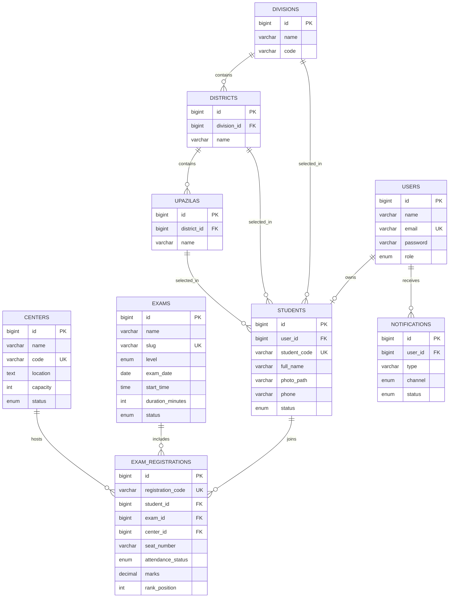

# Entity Relationship Document

## 1. Purpose

This document formally defines the data model for the Math Olympiad Management System, including entities, primary attributes, keys, relationships, and business constraints.

## 2. Modeling Objectives

- support the full registration to exam workflow
- keep identity, profile, scheduling, and operations data separated cleanly
- enforce consistency through foreign keys and uniqueness rules
- remain extensible for attendance, ranking, and future olympiad levels

## 3. Entity Catalog

### 3.1 User

Purpose: stores authentication identity for all platform actors.

Primary attributes:

- `id`
- `name`
- `email`
- `password`
- `role`
- `email_verified_at`
- `created_at`
- `updated_at`

Key rules:

- `email` must be unique
- `role` must be one of `super_admin`, `admin`, or `student`

### 3.2 Student

Purpose: stores extended participant information linked to a user.

Primary attributes:

- `id`
- `user_id`
- `student_code`
- `full_name`
- `photo_path`
- `father_name`
- `mother_name`
- `school_name`
- `class_name`
- `phone`
- `address`
- `division_id`
- `district_id`
- `upazila_id`
- `status`
- `approved_at`
- `rejected_at`
- `approved_by`
- `rejected_by`
- `rejection_reason`

Key rules:

- `user_id` must uniquely reference a single user
- `student_code` is nullable before approval and unique after generation
- `status` must be one of `pending`, `approved`, or `rejected`

### 3.3 Division

Purpose: top-level administrative region.

Primary attributes:

- `id`
- `name`
- `code`

### 3.4 District

Purpose: second-level administrative region.

Primary attributes:

- `id`
- `division_id`
- `name`

### 3.5 Upazila

Purpose: third-level administrative region.

Primary attributes:

- `id`
- `district_id`
- `name`

### 3.6 Center

Purpose: stores exam venue information.

Primary attributes:

- `id`
- `name`
- `code`
- `location`
- `division_id`
- `district_id`
- `upazila_id`
- `capacity`
- `contact_person`
- `contact_phone`
- `status`

Key rules:

- `code` must be unique
- `capacity` must be greater than zero
- `status` should be `active` or `inactive`

### 3.7 Exam

Purpose: stores olympiad event definitions.

Primary attributes:

- `id`
- `name`
- `slug`
- `level`
- `exam_date`
- `start_time`
- `duration_minutes`
- `description`
- `status`

Key rules:

- `slug` must be unique
- `level` should support `school`, `district`, and `national`
- `status` should be `draft`, `published`, or `closed`

### 3.8 ExamRegistration

Purpose: represents a student's participation in a specific exam and center.

Primary attributes:

- `id`
- `registration_code`
- `student_id`
- `exam_id`
- `center_id`
- `seat_number`
- `admit_card_path`
- `id_card_path`
- `attendance_status`
- `marks`
- `rank_position`

Key rules:

- `registration_code` must be unique
- a student must not have duplicate registrations for the same exam
- seat number must be unique within the same exam and center combination

### 3.9 Notification

Purpose: stores outgoing notifications and status tracking.

Primary attributes:

- `id`
- `user_id`
- `type`
- `channel`
- `title`
- `body`
- `status`
- `sent_at`

## 4. Relationship Definitions

### 4.1 User To Student

- Cardinality: one-to-one
- Rule: one student user has one student profile

### 4.2 Division To District

- Cardinality: one-to-many
- Rule: one division contains many districts

### 4.3 District To Upazila

- Cardinality: one-to-many
- Rule: one district contains many upazilas

### 4.4 Student To ExamRegistration

- Cardinality: one-to-many
- Rule: one student may register in multiple exams over time

### 4.5 Exam To ExamRegistration

- Cardinality: one-to-many
- Rule: one exam contains many student registrations

### 4.6 Center To ExamRegistration

- Cardinality: one-to-many
- Rule: one center may host many exam registrations

### 4.7 User To Notification

- Cardinality: one-to-many
- Rule: one user may receive many notifications

## 5. Formal Relationship Matrix

| Parent Entity | Child Entity | Relationship | Notes |
| --- | --- | --- | --- |
| users | students | 1:1 | enforced by unique `user_id` |
| divisions | districts | 1:N | administrative master data |
| districts | upazilas | 1:N | administrative master data |
| students | exam_registrations | 1:N | multiple exam participation |
| exams | exam_registrations | 1:N | assignment records |
| centers | exam_registrations | 1:N | center allocation |
| users | notifications | 1:N | notification history |

## 6. Recommended Constraints

- unique constraint on `users.email`
- unique constraint on `students.student_code`
- unique constraint on `centers.code`
- unique constraint on `exams.slug`
- unique composite constraint on `exam_registrations.student_id` and `exam_registrations.exam_id`
- unique composite constraint on `exam_registrations.exam_id`, `exam_registrations.center_id`, and `exam_registrations.seat_number`

## 7. Normalization Notes

The proposed schema targets third normal form for core operational data.

- user identity is separated from student profile data
- geographic data is normalized into separate location master tables
- exam participation is modeled explicitly through `exam_registrations`
- notifications are stored independently from auth and student data

## 8. ER Diagram

## 9. Future Data Model Extensions

- attendance logs with invigilator reference
- result tables for subject-wise marks
- qualification tables for district or national progression
- audit tables for approval and assignment events